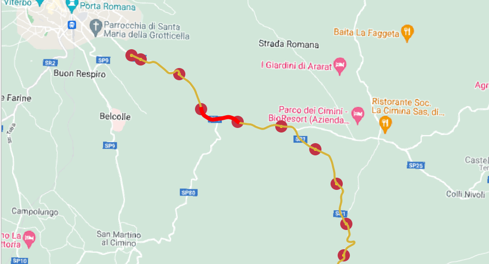
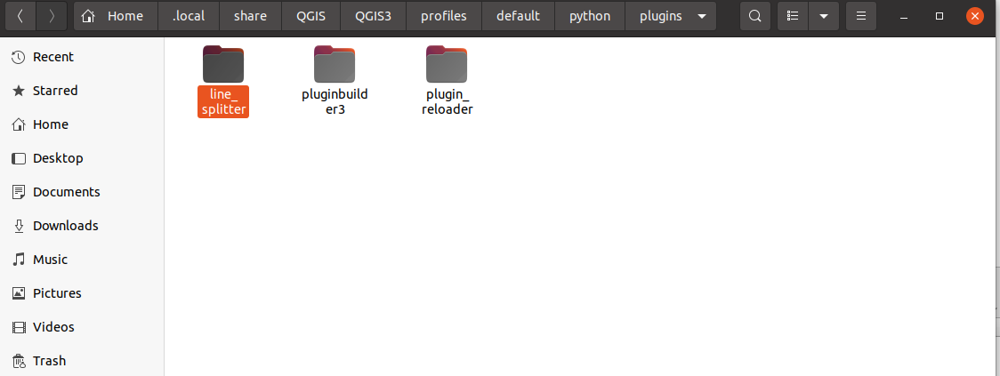
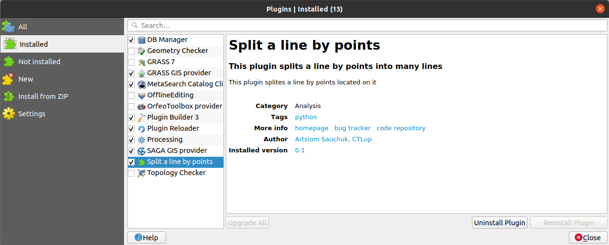
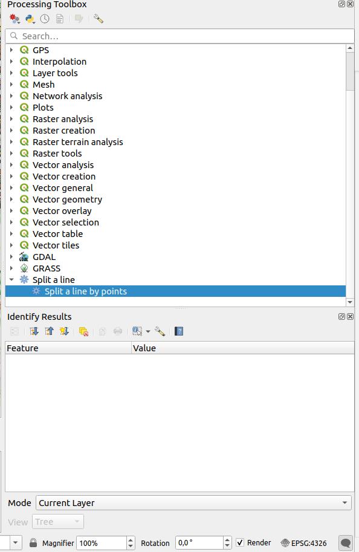
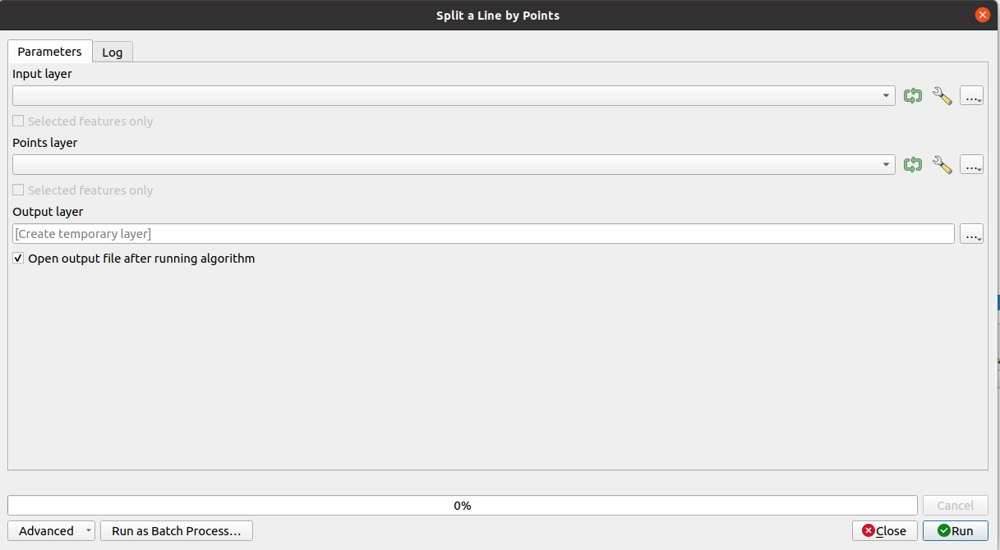

# line_splitter_plugin

A plugin for QGIS

This plugins is used as a tool to devide a vector line layer into sublines. The division is done the positions specified by the input point layer.

## Installation

1. Plugins in QGIS are stored in a special folder. We must copy our plugin directory to that folder before it can be used. In QGIS, locate your current profile folder by going to Settings ‣ User Profiles ‣ Open Active Profile Folder.

2. In the profile folder, copy the plugin folder to python ‣ plugins subfolder.

3. Please, close and open QGIS again.

4. Go to Plugins ‣ Manage and Install plugins and enable the Split a line by points plugin in the Installed tab.

5. Go to Processing ‣ Toolbox. You will notice that there is a new provider at the bottom called **Split a line**. Expand it to find an algorithm named **Split a line by points**. Double-click to launch it.

6. The GUI of the plugin should be opened.

